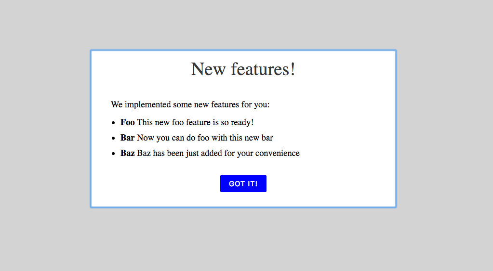

# react-new-features-modal

Show a modal to communicate new added features. The last shown version is stored in localStorage, so each user sees the new feature announcement only once.



## Demo

Play with the [demo](https://codesandbox.io/s/zw0y7l2k7x)

### Only new features

Only features the user hasn't seen yet will be displayed in the pop-up. E.g. if the user has seen version 4 of your application before and current version is 6, only features for versions 5 and 6 will be displayed in the modal.


## Usage

`npm install react-new-features-modal --save`

In your component:

```javascript
import NewFeatures from 'react-new-features-modal'

const notes = {} // see schema below

...
render() {
  return <NewFeatures notes={notes} limit="2"/>
}
```

## Configuration

**notes** - a JSON structure with release notes for consecutive versions:

```js
{
  releases: [{
    version: 1,
    features: [{
      title: "Foo",
      description: "This new foo feature is so ready!"
    }]
  }, {
    version: 2,
    features: [{
      title: "Bar",
      description: "Now you can do foo with this new bar"
    },
    {
      title: "Baz",
      description: "Baz has been just added for your convenience"
    }]
  }]
}
```

**limit** *(optional)* - maximum number of last versions to display. Otherwise no limit.
